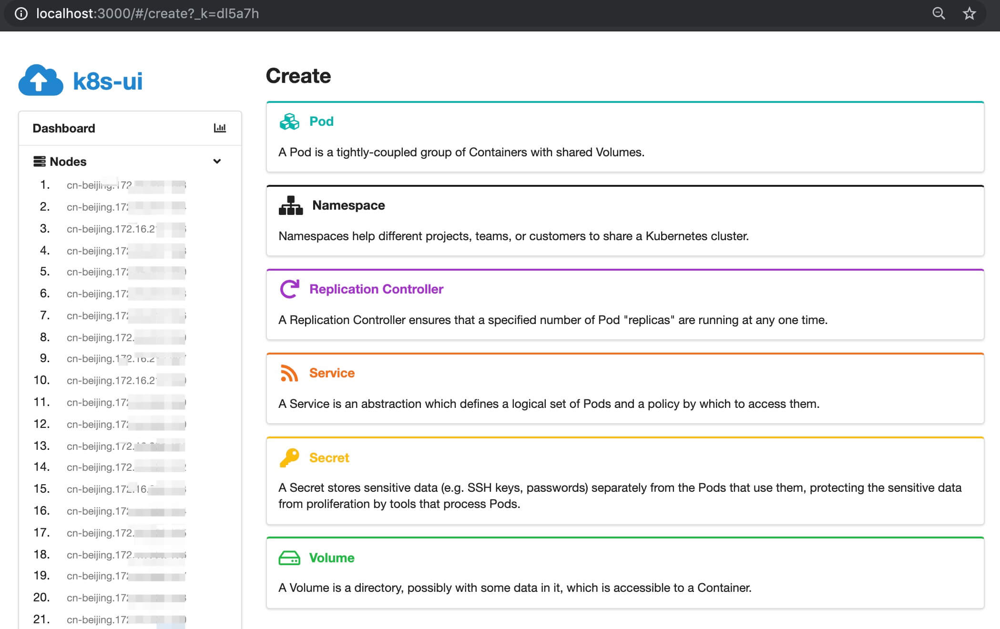
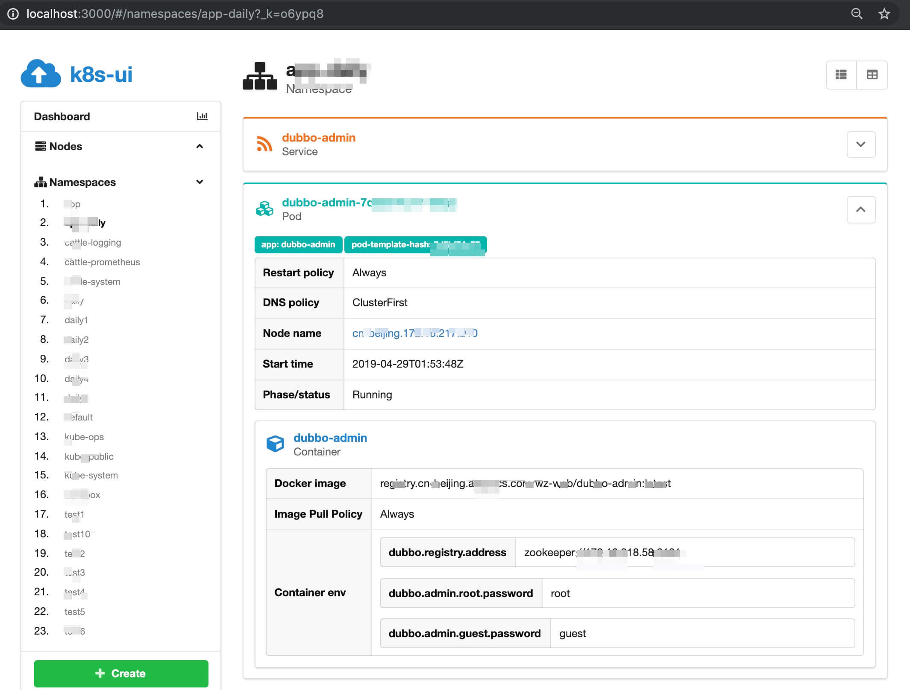

# k8s-ui

Web-based admin frontend for Kubernetes clusters. Work in progress!

- [react](http://reactjs.org)
- [kubernetes-client](https://github.com/godaddy/kubernetes-client)

## Prepare

- ~/.kube/config file for k8s
- Node.js(+NPM)

## Development

```bash
npm install
npm run ui
npm run api
```

## Screenshot




